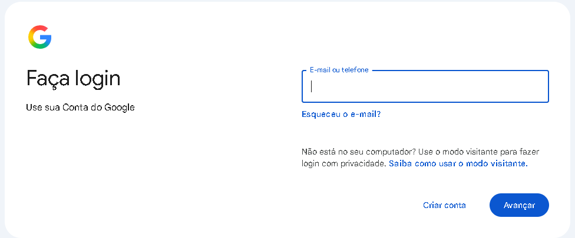
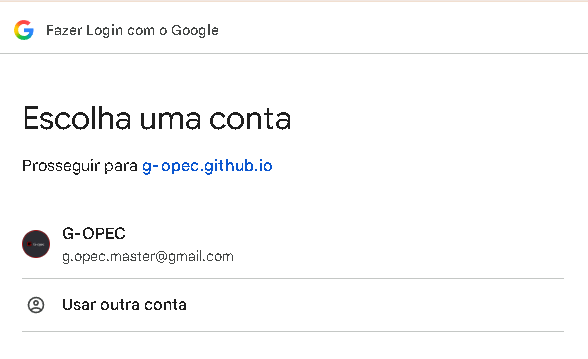
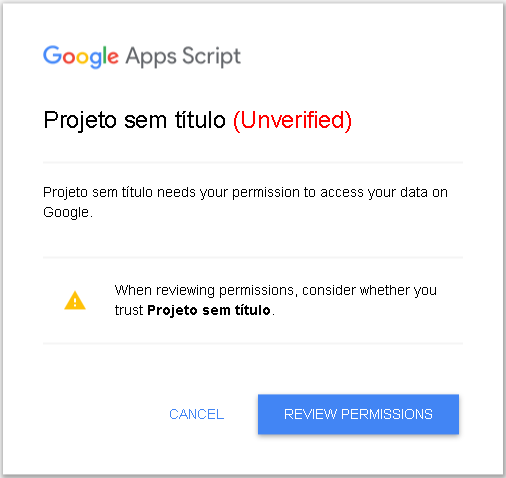
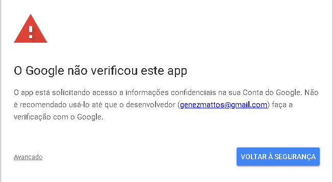
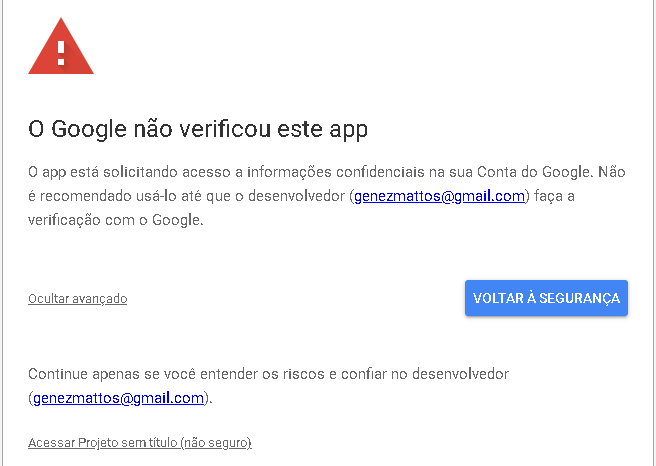
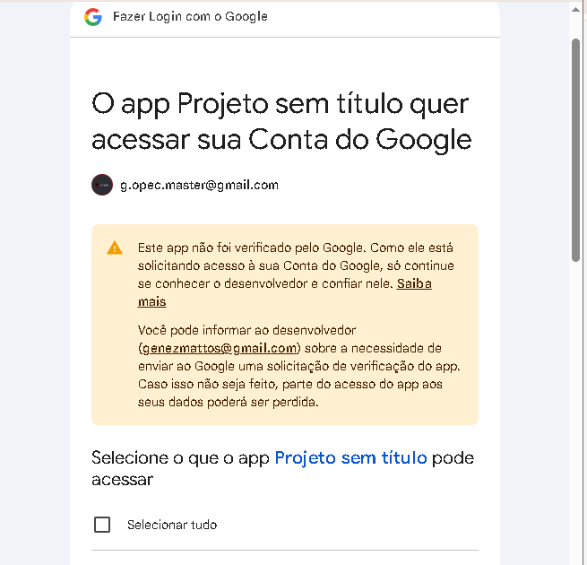
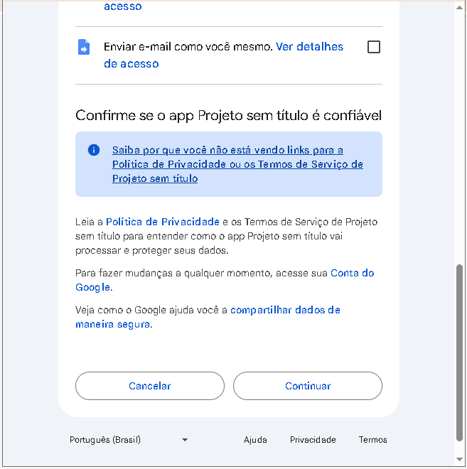

# GIP - Gerenciador de Inserções Partidárias (G-opec) 🗳️📻📺

Bem-vindo ao repositório do **GIP (Gerenciador de Inserções Partidárias)**. Este projeto é uma aplicação web completa desenvolvida para automatizar e facilitar a gestão de campanhas políticas, especificamente no controle de inserções de rádio e TV, mapas de mídia e envio de materiais para emissoras.

🌐 **Acesse a interface pública:** <a href="https://g-opec.github.io/gip/" target="_blank">https://g-opec.github.io/gip/</a>

> **Nota de Arquitetura:** O link acima serve como o repositório do *Front-end* (Interface). Para que o sistema funcione lendo e gravando arquivos, ele opera em conjunto com um backend hospedado no **Google Apps Script**.

---

## 🚀 Funcionalidades Principais

O sistema é dividido em 4 módulos principais que resolvem o fluxo completo de uma agência ou equipe de campanha:

### 1. Programação e Importação de Dados 📊
* **Leitura Inteligente:** Importação de tabelas Excel (`.xlsx`, `.csv`) contendo a grade de inserções.
* **OCR Nativo Integrado:** Capacidade de ler mapas enviados em PDF. O sistema usa a API do Google Drive para converter o PDF em texto (OCR) e extrair os dados da programação automaticamente.
* **Filtros Avançados:** Busca em tempo real por partido, coligação ou cargo.

### 2. Biblioteca de Materiais (Mídias) 🎬
* **Upload Direto:** Envio de arquivos de áudio (Rádio) e vídeo (TV) direto para o Google Drive do usuário.
* **Leitura de Metadados:** Extração automática do tempo de duração do arquivo de mídia anexado.
* **Preview Embutido:** Player HTML5 nativo para ouvir áudios e assistir aos vídeos de campanha de dentro do próprio sistema, sem precisar abrir o Google Drive.

### 3. Geração de Mapa de Mídia 🗺️
* **Grade Dinâmica:** Cruzamento inteligente dos materiais cadastrados (Legenda A, B, C...) com a programação diária (Blocos).
* **Gatilhamento de Regras:** Bloqueio automático de células na grade quando um material de 60 segundos é inserido (ocupando o espaço de duas inserções de 30s).
* **Exportação em PDF:** Geração do Mapa de Mídia final já formatado para folha A4 Paisagem, pronto para ser enviado às emissoras, salvo direto na nuvem.

### 4. Módulo de Envios (E-mail) 📧
* **Disparo Interno:** O usuário não precisa abrir o Gmail. O sistema compõe e envia o e-mail internamente.
* **Anexação Automática:** Permite marcar checkboxes para anexar fisicamente os Mapas de Mídia (PDFs) e os Materiais (MP4/MP3) gerados.
* **Templates Automáticos:** O corpo do e-mail e o assunto são preenchidos automaticamente com base no mapa selecionado.

---

## 🛠️ Tecnologias Utilizadas

* **Front-end:** HTML5, CSS3, JavaScript Vanilla.
* **Manipulação de Planilhas:** Biblioteca `SheetJS` (xlsx.js) no lado do cliente.
* **Back-end:** Google Apps Script (`Código.gs`).
* **Hospedagem UI:** GitHub Pages.
* **Armazenamento e Banco de Dados:** Google Drive API e Documentos do Google (para OCR temporário). Estruturas de dados baseadas em JSON (`materiais.json`, `contatos.json`).

---

## 🔐 Como Autorizar o Apps Script (Primeiro Acesso)

Como o script foi criado por você na sua própria conta e não é um aplicativo comercialmente verificado pelo Google, ao executá-lo ou publicá-lo pela primeira vez, o Google exibirá um alerta de segurança padrão. 

Fique tranquilo! O código é totalmente transparente, roda apenas na sua conta e ninguém mais terá acesso aos seus dados. 

Siga o passo a passo abaixo para autorizar a aplicação:

**Passo 1:** Esteja conectado a uma conta Google, caso contrario você receberá o erro 401 do servidor, basta fazer login no proprio site de busca do google(https://www.google.com/).

*(print do login Google)*
> 

**Evite erros!** Caso ao fazer login você possua mais de uma conta, faça logout em todas e refaça o login apenas na conta que represente sua seção, caso contrario o servidor decidirá automaticamente qual conta será a principal.  

 *(print da seleção de conta)*
> 

**Passo 2:** Ao implantar o projeto ou rodar o código pela primeira vez, um aviso de **"Autorização obrigatória"** vai aparecer. Clique em **Revisar permissões**.

> *(print da tela de "Autorização Obrigatória")*
> 

**Passo 3:** A tela de alerta **"O Google não verificou este app"** será exibida. Não clique em "Voltar à segurança". Em vez disso, clique no link **Avançado** (ou *Advanced*), no canto inferior esquerdo.

> *(print da tela de app não verificado "Avançado")*
> 

**Passo 4:** Logo abaixo, aparecerá um novo link dizendo **"Acessar [Nome do projeto] (não seguro)"**. Clique neste link.

> *(print mostrando o link "Acessar projeto não seguro")*
> 

**Passo 5:** O Google listará quais permissões o sistema precisa (Ler arquivos do Drive, enviar e-mails, etc.). Click em selecionar tudo, Role a página até o final e clique em **Continuar**.

> *(print da tela final de permissões)*
> 
> 

Pronto! A autorização foi concluída. Você só precisará fazer isso **uma única vez**. A partir de agora, o sistema funcionará normalmente de forma automatizada.

---

## ⚙️ Como replicar e instalar este projeto na sua conta

Este projeto é "Serverless" e roda inteiramente no ecossistema gratuito do Google. Para criar a sua própria instância isolada:

1. Acesse [script.google.com](https://script.google.com/) e crie um "Novo Projeto".
2. Copie todo o conteúdo do arquivo `Código.gs` deste repositório e cole no editor do Apps Script.
3. No Apps Script, clique em **Implantar > Nova implantação**.
4. Escolha o tipo **App da Web**.
5. Configure as permissões:
   * **Executar como:** `Eu`
   * **Quem tem acesso:** `Qualquer pessoa com uma Conta do Google` (Ou apenas você, dependendo do seu uso).
6. Autorize os acessos ao seu Drive e Gmail (é 100% seguro, o código roda apenas na sua conta).
7. Acesse a URL gerada e pronto! O sistema criará as pastas estruturadas (ex: `Politica/2024/mapas`) automaticamente no seu Google Drive no primeiro uso.

---
*Desenvolvido para modernizar e agilizar a distribuição e operações comerciais de campanhas políticas (OPEC).*
